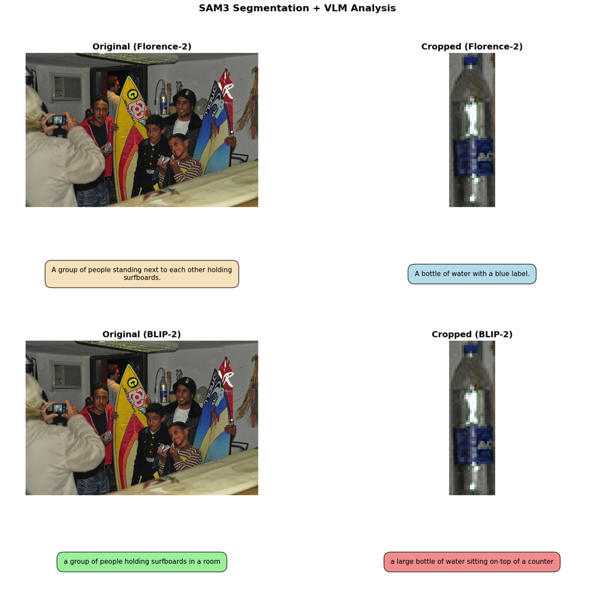

# Automated Region-Based Captioning: A SAM-3, Florence-2, and BLIP-2 Pipeline



## Research Objective
This repository implements an automated vision-language pipeline for dense, region-specific image annotation. Using Segment Anything Model 3 (SAM-3) for zero-shot object extraction, the pipeline isolates regions of interest and evaluates them with Florence-2 and BLIP-2.

The main goal is to compare how a spatially detailed model such as Florence-2 behaves against BLIP-2 when both are asked to describe tightly cropped, low-context object regions.

## Repository Structure
```text
region-captioning-with-sam-florence-blip/
|-- assets/
|   `-- image.png
|-- notebooks/
|   `-- region_captioning_demo.ipynb
|-- README.md
|-- requirements.txt
`-- .gitignore
```

## Main Notebook
The main notebook is `notebooks/region_captioning_demo.ipynb`.

It supports:
- image upload or URL input,
- SAM-3 segmentation with text and box prompts,
- automatic region labeling,
- cropped-region saving,
- original vs cropped caption comparison,
- Florence-2 vs BLIP-2 comparison.

## Setup
Create and activate a Python environment, then install the dependencies:

```bash
pip install -r requirements.txt
```

If you want GPU acceleration, install a CUDA-enabled PyTorch build before running the notebook.

## Run
```bash
jupyter notebook notebooks/region_captioning_demo.ipynb
```

## Notes
- `region_captioning_demo.ipynb` keeps the original project goal while removing hardcoded local paths and fixing environment-specific issues.
- Florence-2 and BLIP-2 are loaded from your Hugging Face cache when available.
- Generated files such as `cropped_outputs/`, `outputs/`, and dataset downloads are ignored by Git.
- The notebook falls back gracefully if the interactive widget backend is unavailable.
